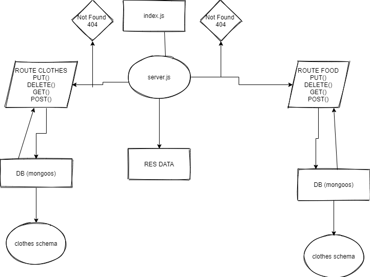

api-server
Setup

Creating the repo on github.

Add Node CI

install packages

make model

make server

make db functions for the table

make the schema 

make router put get post delete

res data from db

*URL's

Heroku clothes

Heroku food

Action

pull req

wml

